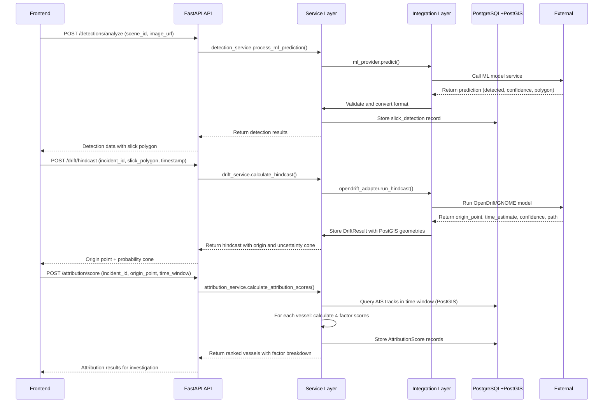

# System Flow & Data Pipeline

> **Understanding How Data Flows Through the National Marine Oil Spill Monitoring System**
> 
> From satellite imagery ingestion to evidentiary dossier generation

## Overview

The oil spill detection and vessel attribution system follows a well-defined 8-stage pipeline that transforms raw satellite and AIS data into actionable intelligence for maritime authorities. Each stage has specific responsibilities, inputs, outputs, and uncertainty quantification.

## The 8-Stage Processing Pipeline

### Stage 1: Satellite Imagery Ingestion
**Input**: Raw SAR satellite scenes (Sentinel-1, RADARSAT-2, etc.)
**Output**: Processed satellite scene metadata
**Responsibility**: 
- Ingest satellite imagery from external providers (Copernicus, ESA, etc.)
- Validate and store scene metadata (timestamp, location, sensor type)
- Trigger ML inference pipeline for spill detection
**Key Components**: 
- `satellite_ingestion_service.py`
- External provider adapters (Copernicus, ESA)
- Database storage in `satellite_scenes` table

### Stage 2: ML-Based Oil Slick Detection
**Input**: Satellite scene metadata and imagery URL
**Output**: Slick detection with polygon geometry and confidence
**Responsibility**:
- Invoke ML model (Ultralytics YOLO) for oil spill segmentation
- Validate ML predictions against PRD contracts
- Convert ML output to internal spill region format
- Apply geospatial calculations (centroid, bounding box)
**Uncertainty Quantification**:
- ML model confidence score (0-1)
- Processing time metrics
- Validation flags
**Key Components**:
- `ml_inference_service.py`
- ML providers (FixtureMLProvider for dev, RESTMLProvider for prod)
- `slick_detection` model
- `spill_region` model

### Stage 3: Slick Characterization
**Input**: Detected spill regions from ML pipeline
**Output**: Characterized slicks with volume estimates and metadata
**Responsibility**:
- Calculate spill volume from area estimates
- Assign severity levels based on size and confidence
- Generate unique detection IDs
- Store in `slick_detections` table linked to incidents
**Uncertainty Quantification**:
- Area-to-volume conversion assumptions
- Spatial resolution limitations of sensor
**Key Components**:
- `detection_service.py` 
- Geospatial service for area calculations
- Incident association logic

### Stage 4: Drift Hindcasting (Origin Estimation)
**Input**: Slick polygon, detection timestamp
**Output**: Probable origin point/time window with hindcast trajectory
**Responsibility**:
- Run OpenDrift/GNOME Lagrangian particle drift model backwards in time
- Calculate probable origin point from slick dispersion patterns
- Generate origin probability cone (uncertainty region)
- Store hindcast path for trajectory analysis
**Uncertainty Quantification**:
- Origin confidence score (0-1) from model ensemble spread
- Origin probability cone geometry
- Temporal uncertainty window
**Key Components**:
- `drift_service.py` (`calculate_hindcast`)
- `opendrift_adapter.py` integration
- `drift_result` model
- ML inference logging

### Stage 5: AIS Data Acquisition & Preparation
**Input**: Origin time window from hindcast (expanded by ±12 hours)
**Output**: Relevant AIS vessel tracks for correlation analysis
**Responsibility**:
- Query PostGIS for AIS tracks within spatiotemporal buffer
- Group tracks by vessel ID for analysis
- Detect AIS transmission gaps (potential dark vessel behavior)
- Prepare track data for correlation algorithms
**Uncertainty Quantification**:
- AIS data completeness (based on provider coverage)
- Gap detection sensitivity (configurable threshold)
- Spatial/temporal interpolation assumptions
**Key Components**:
- `ais_service.py` (`query_ais_tracks`, `detect_ais_gaps`)
- `ais_track` model
- PostGIS spatial+temporal indexing

### Stage 6: Multi-Factor Vessel Attribution
**Input**: Origin point/time window, vessel tracks, vessel metadata
**Output**: Ranked vessel candidates with factor breakdown scores
**Responsibility**:
- Calculate four correlation factors for each vessel:
  1. **Spatial Proximity**: Minimum distance to origin point
  2. **Temporal Match**: Time alignment between vessel presence and origin window  
  3. **Trajectory Alignment**: Heading similarity between vessel track and spill drift
  4. **AIS Anomaly**: Presence of transmission gaps during spill window
- Apply weighted formula: 0.3×spatial + 0.3×temporal + 0.25×trajectory + 0.15×anomaly
- Generate explainable attribution reports
**Uncertainty Quantification**:
- Individual factor scores (0-1 scale)
- Combined confidence score
- Gap detection flag and explanation text
- Score sensitivity to input parameters
**Key Components**:
- `attribution_service.py` (`calculate_attribution_scores`)
- `attribution_score` model (stores all factor scores)
- Vessel metadata enrichment

### Stage 7: Investigation Aggregation
**Input**: Incident, detection, drift results, attribution scores, vessel tracks
**Output**: Consolidated investigation package for frontend consumption
**Responsibility**:
- Join all related data for an incident into single API response
- Format data for efficient frontend consumption
- Include all uncertainty metrics and explanatory text
- Apply access controls (analyst/admin roles)
**Key Components**:
- `investigation_service.py`
- `investigation` model (aggregation entity)
- API endpoints in `investigations.py`

### Stage 8: Evidence Dossier Generation
**Input**: Complete investigation package
**Output**: Legally defensible evidentiary dossier with chain of custody
**Responsibility**:
- Compile all evidence: satellite imagery, AIS tracks, drift models, attribution scores
- Apply cryptographic hashing for chain of custody (SHA-256)
- Generate formatted reports (PDF/print layouts)
- Include metadata: processing timestamps, analyst notes, confidence levels
- Support export/print functionality
**Key Components**:
- `evidence_service.py`
- Evidence PDF generation libraries
- Export endpoints in `evidence.py` (conceptual)
- Cryptographic verification utilities

## Data Flow Diagrams

### Simplified Pipeline Flow
```
Satellite Imagery
         ↓
[Stage 1] Ingestion → Satellite Scene Metadata
         ↓
[Stage 2] ML Detection → Slick Detection (Polygon + Confidence)  
         ↓
[Stage 3] Characterization → Volume Estimates + Severity
         ↓
[Stage 4] Drift Hindcast → Origin Point/Time + Uncertainty Cone
         ↓
[Stage 5] AIS Acquisition → Vessel Tracks + Gap Detection
         ↓
[Stage 6] Attribution → Ranked Vessels + Factor Breakdown
         ↓
[Stage 7] Investigation → Consolidated Investigation Package
         ↓
[Stage 8] Evidence → Evidentiary Dossier + Chain of Custody
```

### Detailed Attribution Calculation Flow
For each vessel in the spatiotemporal search window:
```
Vessel Track Points
         ↓
Sort by Time → Calculate Coordinates Array
         ↓
├─ Spatial Proximity: min(distance to origin) → Score [0-1]
├─ Temporal Match: |nearest_point - origin_center| → Score [0-1]  
├─ Trajectory Alignment: |vessel_heading - spill_angle| → Score [0-1]
└─ AIS Anomaly: gap_detection_during_window → Score [0-1] (0 or 1)
         ↓
Apply Weights: 0.3×S + 0.3×T + 0.25×Tr + 0.15×A → Combined Score
         ↓
Store: All individual scores + combined + explanation
         ↓
Sort All Vessels: Descending by combined score → Final Ranking
```

## Uncertainty Propagation

Uncertainty is tracked and propagated through each stage:

1. **ML Detection**: Model confidence → affects detection reliability
2. **Drift Hindcast**: Origin confidence + probability cone → affects spatial/temporal windows  
3. **AIS Processing**: Gap detection → affects anomaly score
4. **Attribution**: Individual factor scores → combined confidence
5. **Investigation**: Aggregation preserves all uncertainty metrics
6. **Evidence**: Explicit documentation of all confidence levels

## API Contract & Data Flow

### Key API Endpoints by Pipeline Stage

**Stage 1-3 (Detection)**:
- `POST /api/v1/detections/analyze` - Trigger ML analysis on satellite scene
- `GET /api/v1/detections` - Retrieve characterized detections

**Stage 4 (Drift)**:
- `POST /api/v1/drift/hindcast` - Calculate origin from slick
- `POST /api/v1/drift/forecast` - Predict future slick movement

**Stage 5 (AIS)**:
- `GET /api/v1/ais/tracks` - Query vessel tracks (used internally)

**Stage 6 (Attribution)**:
- `POST /api/v1/attribution/score` - Calculate vessel correlation scores

**Stage 7 (Investigation)**:
- `GET /api/v1/investigations/{id}` - Get complete investigation package

**Stage 8 (Evidence)**:
- `GET /api/v1/evidence/{id}` - Retrieve evidence dossier
- `POST /api/v1/evidence/{id}/export` - Export as PDF

### Example Data Flow Through API Calls



## Error Handling & Resilience

### Graceful Degradation Patterns

1. **ML Service Unavailable**: 
   - Fall back to fixture data in development
   - Return safe defaults with low confidence
   - Log warning but don't fail the pipeline

2. **Drift Service Failure**:
   - Use slick centroid as origin estimate with low confidence
   - Skip hindcast path generation
   - Continue with available data

3. **AIS Data Gaps**:
   - Expected and handled as feature (not error)
   - Low temporal match score but process continues
   - Generate investigation state indicating dark vessel suspicion

4. **Database Connection Issues**:
   - Standard error envelope with RETRY_AVAILABLE code
   - Frontend implements retry with exponential backoff
   - Health checks monitor database connectivity

### Standard Error Envelope (PRD §36)
All API errors follow this format:
```json
{
  "error": {
    "code": "ERROR_CODE",
    "message": "Human readable error message"
  }
}
```

Approved error codes include: UNAUTHORIZED, FORBIDDEN, NOT_FOUND, CONFLICT, VALIDATION_ERROR, INTERNAL_ERROR, SERVICE_UNAVAILABLE, RATE_LIMITED, etc.

## Performance Characteristics

### Typical Processing Times (Development Fixtures)
- **Stage 1-2 (Detection)**: 100-500ms (fixture-based)
- **Stage 3 (Characterization)**: <10ms
- **Stage 4 (Drift)**: 500-2000ms (OpenDrift model)
- **Stage 5 (AIS)**: 50-200ms (PostGIS query)
- **Stage 6 (Attribution)**: 100-500ms (depends on vessel count)
- **Stage 7 (Investigation)**: 50-150ms (data aggregation)
- **Stage 8 (Evidence)**: 200-1000ms (report generation)

### Production Performance Considerations
- **ML Inference**: GPU acceleration recommended for production models
- **Drift Modeling**: OpenDrift can be computationally intensive; consider caching
- **AIS Queries**: Proper PostGIS indexing critical for performance
- **Caching Strategy**: Consider Redis for frequent investigation lookups
- **Horizontal Scaling**: Stateless services allow scaling behind load balancer

## Extensibility Points

### Adding New Data Sources
1. **New Satellite Provider**: 
   - Create new adapter in `integrations/satellite/`
   - Update `satellite_ingestion_service.py` factory
   - Add to PRD data-source table

2. **New AIS Provider**:
   - Create adapter in `integrations/ais/` 
   - Update `ais_service.py` provider selection
   - Configure API keys in environment

3. **New Drift Model** (e.g., switch from OpenDrift to GNOME):
   - Implement adapter in `integrations/drift/` following interface
   - Update `drift_service.py` factory
   - No API contract changes required

### Adding New Attribution Factors
1. Create new factor calculation function in `attribution_service.py`
2. Update the weighted formula in `calculate_attribution_scores()`
3. Add corresponding field to `AttributionScore` model
4. Update API schemas to expose new factor
5. Update frontend visualization components

## Security & Privacy Considerations

### Data Protection
- **AIS Data**: Treat as sensitive maritime domain awareness data
- **ML Models**: May contain proprietary algorithms (handle accordingly)
- **Evidence**: Chain of custody must be cryptographically verifiable
- **User PII**: Minimal collection (officer name, email, role only)

### Access Controls
- **Role-Based Access**: `analyst` (read/write investigations) vs `admin` (system config)
- **All endpoints protected** by JWT bearer token validation
- **Frontend role checks are UX only** - server-side enforcement mandatory
- **API keys/secrets**: Never in code; use environment variables or secret managers

### Audit Logging
- **ML Inference Log**: tracks all model invocations with latency and status
- **Investigation Events**: immutable log of all investigation actions
- **Access Logs**: track who accessed what evidence and when
- **Change Tracking**: SQLAlchemy events for critical data modifications

---

*Last updated: 2026-09-06*
*Generated as part of project documentation initiative*